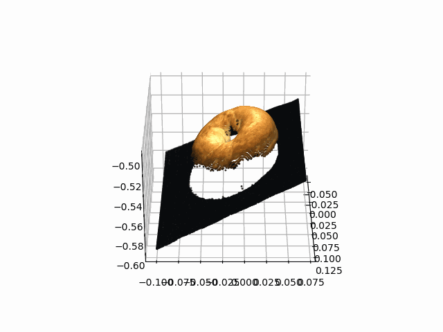
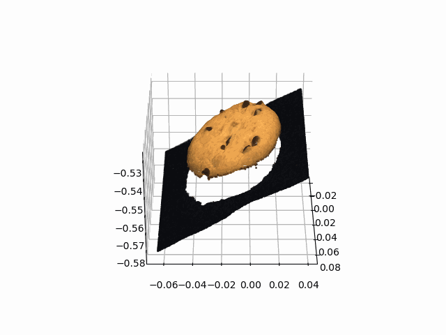
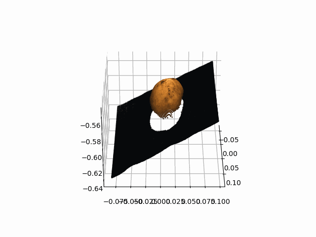
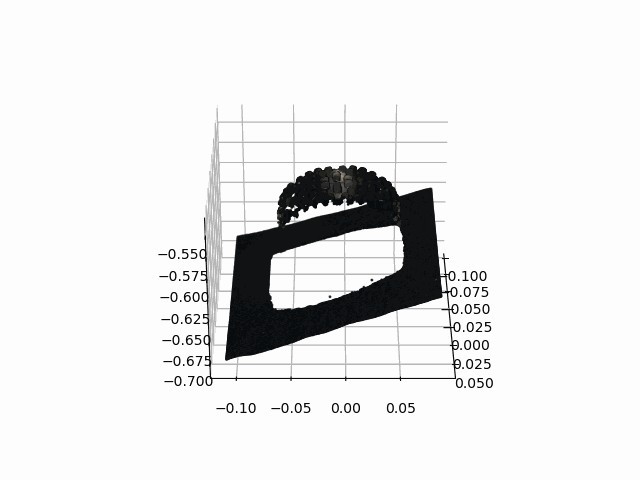

# MVTec3Dのデータを可視化するコードです
[![Contributors][contributors-shield]][contributors-url]
[![Forks][forks-shield]][forks-url]
[![Stargazers][stars-shield]][stars-url]

## 可視化例
- Bagel
  - 
- Cookie
  - 
- Potato
  - 
- Tire
  - 

<!-- MARKDOWN LINKS & IMAGES -->
[contributors-shield]: https://img.shields.io/github/contributors/Absolute-Value/MVTec3D_Visualization?style=for-the-badge
[contributors-url]: https://github.com/Absolute-Value/Best-README-Template/graphs/contributors
[forks-shield]: https://img.shields.io/github/forks/Absolute-Value/MVTec3D_Visualization?style=for-the-badge
[forks-url]: https://github.com/Absolute-Value/Best-README-Template/network/members
[stars-shield]: https://img.shields.io/github/stars/Absolute-Value/MVTec3D_Visualization?style=for-the-badge
[stars-url]: https://github.com/Absolute-Value/MVTec3D_Visualization/stargazers

(<a href="#readme-top">back to top</a>)

